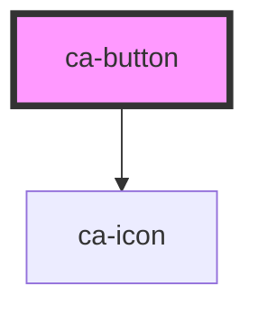

# ca-button

<!-- Auto Generated Below -->

## Properties

| Property     | Attribute     | Description | Type                                                                     | Default     |
| ------------ | ------------- | ----------- | ------------------------------------------------------------------------ | ----------- |
| `autofocus`  | `autofocus`   |             | `boolean`                                                                | `undefined` |
| `circle`     | `circle`      |             | `boolean`                                                                | `undefined` |
| `disabled`   | `disabled`    |             | `boolean`                                                                | `undefined` |
| `loading`    | `loading`     |             | `boolean`                                                                | `undefined` |
| `nativeType` | `native-type` |             | `string`                                                                 | `'button'`  |
| `plain`      | `plain`       |             | `boolean`                                                                | `undefined` |
| `round`      | `round`       |             | `boolean`                                                                | `undefined` |
| `size`       | `size`        |             | `string`                                                                 | `undefined` |
| `type`       | `type`        |             | `"danger" \| "default" \| "info" \| "primary" \| "success" \| "warning"` | `'default'` |

## Dependencies

### Depends on

- [ca-icon](../icon)

### Graph

----------------------------------------------

*Built with [StencilJS](https://stenciljs.com/)*
