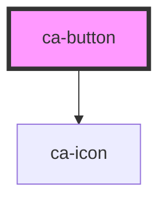

# ca-button

<!-- Auto Generated Below -->

## Properties

| Property   | Attribute  | Description | Type      | Default     |
| ---------- | ---------- | ----------- | --------- | ----------- |
| `circle`   | `circle`   |             | `boolean` | `undefined` |
| `disabled` | `disabled` |             | `boolean` | `undefined` |
| `loading`  | `loading`  |             | `boolean` | `undefined` |
| `plain`    | `plain`    |             | `boolean` | `undefined` |
| `round`    | `round`    |             | `boolean` | `undefined` |
| `size`     | `size`     |             | `string`  | `undefined` |
| `type`     | `type`     |             | `string`  | `undefined` |

## Dependencies

### Depends on

- [ca-icon](../ca-icon)

### Graph

----------------------------------------------

*Built with [StencilJS](https://stenciljs.com/)*
